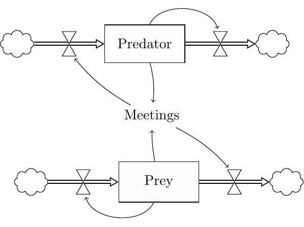
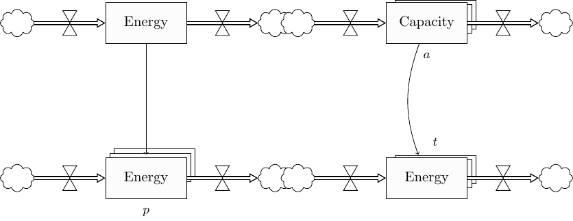

# Latex package for System Dynamics 

This aims at supporting latex users with some tikz experience to draw system dynamics (SD) diagrams
in his/her latex documents.

## Usage
1. Add the following line to your preamble:
    ````
    \usepackage{systemdynamics}
    ````
2. Compile using pdflatex. Make sure the systemdynamics.sty file is somewhere where your latex distribution will find it.


## Commands
The package provides tikz styles and shortcuts.

### Drawing Stocks
To draw a stock with the internal name _nodename_ and the label _nodelabel_ use the command:

````
\node (nodename) [stock] {nodelabel};
````

To position the node relative to an existing node, you can use the familiar positoning commands
inside the [], i.e.
````
\node (nodename) [stock, below=1em of othernode] {nodelabel};

````

### Drawing N-Dimensional Stocks

N-dimensional stocks represent quantities that are indexed over a discrete dimension
such as **pathways** (_p_), **technologies** (_t_), **age cohorts** (_a_), or
**layers**.  They are drawn as three stacked boxes with a small dimension
identifier placed either above or below the stack.

````
\ndstock[tikz-options]{name}{label}{dimtype}{dimpos}
````

| Argument      | Description |
|---------------|-------------|
| `tikz-options`| *(optional)* TikZ placement/style options, e.g. `below=7em of other` |
| `name`        | TikZ node name for the main (front) box |
| `label`       | Text shown inside the main box |
| `dimtype`     | Dimension identifier rendered in the extra entry, e.g. `$p$` for pathways, `$t$` for technologies |
| `dimpos`      | Where the dimension entry is placed: `above` or `below` |

The command creates the following named nodes that can be referenced by arrows
and flow commands:

- _name_ — the main (front) box
- _name\_s1_, _name\_s2_ — the two shadow boxes behind the main box
- _name\_dim_ — the dimension label node

Since the main box is a standard `stock` node, all the usual flow commands
(`\flowIn`, `\flowOut`) and arrows (`\sdarrow`) work with N-dimensional stocks
exactly as they do with ordinary stocks.

**Examples:**

````latex
% Stock indexed over pathways (p), dimension label shown below
\ndstock{energy_p}{Energy}{$p$}{below}

% Stock indexed over technologies (t), positioned relative to another node,
% dimension label shown above
\ndstock[below=7em of energy]{energy_t}{Energy}{$t$}{above}

% Add flows and arrows exactly as for a normal stock
\flowIn{energy_p}{}
\flowOut{energy_p}{}
\sdarrow{energy}{energy_p}{}
````

### Drawing Nodes
To add positive or negative flows with the label _flowlabel_ to the node _stockname_, use the following commands:
````
\flowIn{stockname}{flowlabel}
````
````
\flowOut{stockname}{flowlabel}
````
This will create nodes with names  _in\_stockname_ or _out\_stockname_ respectively.


### Drawing SD Variables
To create a system dynamics variable with name _varname_ and label _varlabel_, use the command 
````
\node (varname) [sdvariable]  {varlabel};
````


### Drawing Arrows
To indicate relationships, use the ````\sdarrow```` command:
````
\sdarrow{fromNode}{toNode}{bend left=5}
````
The last argument is optional and contains tikz options that will be passed directly to tikz to control the arrow curvature etc.

You can use the node names of existing stocks, flows and variables to define start and end of the arrow.
To avoid arrows that overlap with the node labels, the flows have additional points that can be used as start or endpoints of sdarrows:
- _in\_stock_down_: A node below the incoming flow label
- _in\_stock_down\_nolabel_: A node below the incoming flows hourglass (useful if the flow has no label)
- _in\_stock_up_: A node above the incoming flows hourglass
- _out\_stock_down_: A node below the outcoming flow label
- _out\_stock_down\_nolabel_: A node below the outcoming flows hourglass (useful if the flow has no label)
- _out\_stock_up_ A: node above the outcoming flows hourglass


## Example Diagrams

### Predator-Prey (Standard Stocks)
The following code draws a simple two-state diagram.

````latex
\documentclass{standalone}
\pagestyle{empty}
\usepackage{systemdynamics}

\begin{document}
\begin{tikzpicture} 

% Predator population
\node (predator) [stock] {Predator};
\flowIn{predator}{}
\flowOut{predator}{}
\sdarrow{predator}{out_predator_up}{bend left=70}

% Prey population
\node (prey) [stock, below=7em of predator, xshift=1em] {Prey};
\flowIn{prey}{}
\flowOut{prey}{}
\sdarrow{prey}{in_prey_down_nolabel}{bend left=70}

%Meetings
\node (meetings) [sdvariable, below=3em of predator, xshift=0.5em]  {Meetings};
\sdarrow{prey}{meetings}{bend left=5}
\sdarrow{predator}{meetings}{bend left=10}
\sdarrow{meetings}{in_predator_down_nolabel}{bend left=10}
\sdarrow{meetings}{out_prey_up}{bend left=10}

\end{tikzpicture}
\end{document}
````

The output will look as follows:


### N-Dimensional Stocks Example

The following code (see `ndim_example.tex`) demonstrates stocks indexed over
different discrete dimensions.  The three stacked boxes give an immediate
visual cue that the quantity is differentiated by a dimension, and the small
italic label (placed above or below the stack) identifies that dimension.

````latex
\documentclass{standalone}
\pagestyle{empty}
\usepackage{systemdynamics}

\begin{document}
\begin{tikzpicture}

% Ordinary single-dimension stock
\node (energy) [stock] {Energy};
\flowIn{energy}{}
\flowOut{energy}{}

% Stock indexed over pathways (p), label shown below
\ndstock[below=8em of energy]{energy_p}{Energy}{$p$}{below}
\flowIn{energy_p}{}
\flowOut{energy_p}{}
\sdarrow{energy}{energy_p}{}

% Stock indexed over technologies (t), label shown above
\ndstock[right=14em of energy_p]{energy_t}{Energy}{$t$}{above}
\flowIn{energy_t}{}
\flowOut{energy_t}{}

% Stock indexed over layers (a), label shown below
\ndstock[right=14em of energy]{cap}{Capacity}{$a$}{below}
\flowIn{cap}{}
\flowOut{cap}{}
\sdarrow{cap}{energy_t}{bend right=20}

\end{tikzpicture}
\end{document}
````

The output will look as follows:


